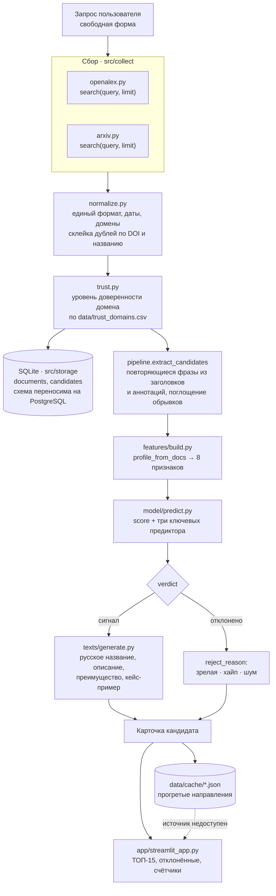

# Архитектура решения

Сервис «Горизонт» принимает запрос по технологическому направлению, собирает
документы из открытых источников, выделяет кандидатов в слабые сигналы,
оценивает их интерпретируемой моделью и отдаёт ранжированную выдачу
с обоснованием по каждому пункту.

Слои разделены намеренно: парсинг, инференс модели и интерфейс не знают друг
о друге и общаются через фиксированные форматы данных.

---

## Схема обработки



---

## Состав по слоям

| Слой | Файлы | Что делает |
|---|---|---|
| Сбор | `src/collect/openalex.py`, `arxiv.py` | Запрос к открытым API. Три попытки с нарастающей паузой; при недоступности возвращают пустой список и не роняют пайплайн |
| Нормализация | `src/collect/normalize.py` | Единый формат документа, даты к `YYYY-MM-DD`, домен из ссылки, склейка дублей по DOI и по близким названиям |
| Доверенность | `src/collect/trust.py` | Уровень источника по словарю `data/trust_domains.csv`; без словаря работает по правилам |
| Хранение | `src/storage/db.py`, `schema.sql` | SQLite. Таблицы `documents` и `candidates` с индексами по запросу, дате и домену |
| Кандидаты | `src/pipeline.py` | Группировка документов по повторяющимся фразам вместо кластеризации: работает за секунды и объясняется словами |
| Признаки | `src/features/build.py` | Восемь признаков на двух осях исходного датасета — стадия развития и динамика упоминаний |
| Модель | `src/model/train.py`, `predict.py` | Линейная модель: веса читаются напрямую, поэтому по каждому кандидату видно, какие признаки привели к решению |
| Тексты | `src/texts/generate.py`, `providers.py` | Русское название, описание, преимущество и кейс строго по найденным документам |
| Интерфейс | `src/app/streamlit_app.py`, `ui.py` | Страница вызывает только `pipeline.run(query)` и рисует пришедшее |

---

## Форматы на границах слоёв

Два формата, зафиксированные до написания кода. Менять их нельзя без
согласования: на них завязаны все четыре слоя.

**Документ** — что возвращает любой сборщик:

```
source_id, title, abstract, url, published, source_type, language,
venue, authors, orgs, domain, trust, translated, ru_summary, collected_at
```

Поля не убираются: если данных нет, ставится `None`.

**Карточка кандидата** — что `pipeline.run(query)` отдаёт интерфейсу:

```
technology, technology_original, technology_language, area, score,
top_features[{name, value, direction}], description, advantage,
case_example, sources[Документ], verdict, reject_reason,
doc_count, sources_shown, docs_collected
```

`verdict` — «сигнал» или «отклонено». `reject_reason` — «зрелая», «хайп»
или «шум». Счётчики для интерфейса считает `pipeline.stats(candidates)`.

---

## Отказоустойчивость

Требование раздела 8.2 ТЗ. Заложено на четырёх уровнях:

1. **Падение одного источника не ломает остальные** — каждый сборщик обёрнут
   в перехват исключений, пайплайн продолжает с тем, что собралось.
2. **Три попытки с нарастающей паузой** на кодах 429 и 5xx.
3. **Кеш прогретых направлений** в `data/cache/` — демонстрация работает
   при полностью недоступной сети.
4. **Интерфейс не показывает трассировку** — при ошибке пайплайна выводит
   человеческое сообщение и предлагает прогретые направления.

---

## Развёртывание

Два независимых пути, оба должны работать.

**Docker** — основной, им пользуется эксперт:

```bash
docker compose up --build
```

Собирает образ на `python:3.11-slim`, ставит зависимости отдельным слоем,
поднимает приложение на порту 8501. Кеш вынесен в том и переживает
перезапуск контейнера. Есть проверка живости через `/_stcore/health`.

**Без Docker** — виртуальное окружение, `requirements.txt`, запуск
`streamlit run src/app/streamlit_app.py`. Подробности в `README.md`.

Ключи только через переменные окружения, в коде и в репозитории их нет —
шаблон в `.env.example`. Ключ OpenAlex необязателен: без него запросы идут
в общий пул, медленнее. Без ключа языковой модели резюме строится
извлечением предложений из источника и помечается в выдаче.

---

## Почему так, а не иначе

**Линейная модель вместо нейросети.** Пункт 8.3 ТЗ оценивает
интерпретируемость: система обязана показать, по каким признакам наблюдение
отнесено к сигналу. У линейной модели вклад каждого признака читается
напрямую и попадает в карточку.

**Фразы вместо кластеризации.** Собственная кластеризация требует настройки
и плохо ведёт себя на малой выборке документов. Группировка по повторяющимся
фразам работает за секунды, объясняется одним предложением и не даёт
неповторимых результатов от запуска к запуску.

**SQLite вместо PostgreSQL.** Решение времени: схема в `schema.sql` написана
переносимо и применяется к PostgreSQL без правок. Замена — одна строка
подключения.

**Streamlit вместо React.** Интерфейс и модель пишутся на одном языке,
разворачивается одной командой. ТЗ допускает базовый интерфейс на Streamlit.

---

## Известные ограничения

Названы честно, поскольку влияют на интерпретацию результатов.

1. **Негативный класс.** Пока модель обучена на черновых примерах, метрики
   в `reports/metrics.md` завышены — там стоит предупреждение об этом.
2. **Патентные базы не подключены.** Источники ограничены научными
   публикациями и препринтами.
3. **Отсутствие источников высокого уровня не ведёт к отсеву.** По ранним
   темам научных публикаций часто ещё нет; такие наблюдения получают
   пониженную уверенность, а не исключение из выдачи.

Методология отбора признаков и определение слабого сигнала — в
`docs/methodology.md`. Метрики модели — в `reports/metrics.md`.
